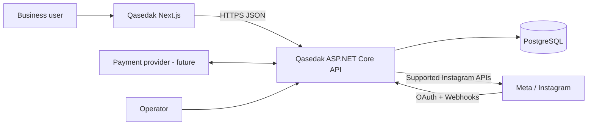

# Qasedak — Software Architecture Document

**Architecture style:** Modular Monolith + Clean Architecture inside each business module  
**Backend:** ASP.NET Core Web API / .NET 10  
**Frontend:** independent Next.js application  
**Data:** PostgreSQL 18 with module-owned schemas

## 1. Overview

Qasedak is organized first by business capability, then by Clean Architecture layers inside each module. This avoids a single repository-wide `Domain/`, `Application/` and `Infrastructure/` becoming a cross-product dumping ground. The ASP.NET Core API is a thin composition/transport root. Next.js is a separate application and communicates only through network/API contracts.

The initial runtime is a modular monolith, not microservices. This intentionally minimizes operational complexity while preserving business boundaries that could support future extraction if actual scale/ownership needs justify it.

## 2. Goals

- Keep each business capability locally understandable as the repository grows.
- Enforce inward dependencies at compile/project-reference and CI level.
- Keep business rules independent of ASP.NET, EF Core, PostgreSQL, Meta APIs and UI.
- Support reliable webhook/automation behavior under retries and duplicates.
- Preserve workspace isolation and secret safety.
- Make multi-agent development reproducible through tests, Graphify and versioned state.
- Produce deterministic container artifacts and a simple deployment topology.

## 3. System Context



The browser never receives Meta credentials. External-provider contracts terminate at backend Infrastructure adapters. PostgreSQL is internal state. Public networking/reverse-proxy/TLS details are deployment responsibilities rather than Domain concerns.

## 4. High-Level Architecture

```text
frontend/Qasedak.Web (Next.js)
          |
          | HTTPS / versioned API
          v
backend/Qasedak.Api  <-- composition root / HTTP boundary
          |
          +--> Modules/Identity
          +--> Modules/Instagram
          +--> Modules/Automations
          +--> Modules/Conversations
          +--> Modules/Contacts
          +--> Modules/Billing

Within every module:
Infrastructure  --->  Application  --->  Domain
```

`BuildingBlocks` contains only small, stable cross-cutting primitives and abstractions. It must not become a shared business-domain layer. A module does not directly reference another business module. Cross-module collaboration requires an explicit integration contract/event and, when it changes architecture, an ADR.

## 5. Modules

| Module | Owns | Does not own |
|---|---|---|
| Identity | users, workspaces, membership/roles, auth context | Instagram tokens, automation rules |
| Instagram | connected accounts, Meta auth/token state, webhook integration/normalization, API adapters | inbox business state, automation definitions |
| Conversations | conversation/message projection and reply use cases | raw Meta payload schemas |
| Automations | definitions/versions, triggers, conditions, actions, execution semantics | HTTP/webhook transport details |
| Contacts | workspace-local contact identity, tags/notes/projections | global identity resolution |
| Billing | plans/subscriptions/entitlements and provider boundary | UI-only entitlement decisions |

New modules require a clear business capability/ownership reason; folders are not modules merely because a technical concern exists.

## 6. Layer Responsibilities

### Domain

Represents business meaning and invariants: entities/aggregates/value objects/domain events/policies when complexity needs them. It answers questions such as “is this automation valid to activate?” It must not reference ASP.NET Core, EF Core, PostgreSQL, Meta DTOs, serialization, clocks/filesystems/network clients or UI.

### Application

Orchestrates a business use case: commands/queries/use-case handlers, ports/interfaces, transaction boundaries, authorization requirements and result semantics. It answers “what steps are required to fulfill this request?” It depends inward on its module Domain and stable application building blocks. It should not contain vendor HTTP/EF implementation details.

### Infrastructure

Implements ports and technical details: EF Core/PostgreSQL mappings/repositories, Meta HTTP/OAuth adapters, cryptographic/secret adapters, provider clients and other external integration code. Persistence is intentionally part of each module’s Infrastructure rather than a global Persistence project.

### API

ASP.NET Core composition root and transport: endpoint routing, request/response mapping, middleware, authentication wiring, problem details, health endpoints and dependency registration. Business decisions do not belong in endpoints/controllers.

### Frontend

Independent Next.js application organized by product feature. It renders Penpot-approved interactions, manages client/server UI concerns and consumes backend contracts. It is never a business authorization boundary.

## 7. Dependency Rules

Compiler/CI-enforced rules:

```text
Module.Domain
  -> BuildingBlocks.Domain only

Module.Application
  -> own Module.Domain
  -> BuildingBlocks.Application/Domain

Module.Infrastructure
  -> own Module.Application/Domain
  -> BuildingBlocks.Infrastructure/Application/Domain

Qasedak.Api
  -> module Infrastructure projects + building blocks

Qasedak.Web
  -> no backend source/project reference; HTTP contracts only
```

Direct business-module project references are forbidden. Domain/Application must not reference Infrastructure. `scripts/check_architecture.py` rejects violations and CI runs it. If a cross-module interaction is required, define an intentional event/contract at an approved boundary instead of reading another module’s database tables.

## 8. Data Architecture

The initial deployment uses one PostgreSQL 18 instance/database for operational simplicity. Ownership is segmented by logical schemas:

```text
identity.*
instagram.*
automations.*
conversations.*
contacts.*
billing.*
```

Each module owns its EF Core configuration/migrations and tables. Cross-schema foreign keys/joins are avoided unless a documented ADR proves they are the correct coupling. Cross-module references prefer stable identifiers and application/integration contracts. UUIDv7 is the default candidate for internal IDs where appropriate; timestamps are stored as UTC-aware `timestamptz`.

Webhook ingestion and side effects require explicit idempotency/inbox/outbox decisions in the owning milestones. External credentials are protected separately from ordinary data. See `06-DATABASE-DESIGN.md`.

## 9. Runtime Flows

### Instagram connection

Next.js → API application use case → Instagram Infrastructure OAuth adapter → Meta → callback to API → validated state/token exchange → protected module persistence → safe connection-state response.

### Webhook

Meta → API webhook endpoint → authenticity/shape verification → durable Instagram inbox/deduplication → acknowledge → normalize integration event → interested application/module processing → observable status.

### Automation

Normalized supported event → select relevant active automation version → deterministic condition evaluation → create idempotent execution/effect identity → action port → Instagram Infrastructure API adapter → record success/transient/permanent result.

Long-running/retry work may introduce a durable worker/queue once M04/M06 selects the concrete mechanism; the Domain is not coupled to that mechanism.

## 10. Security

- OAuth state/callback validation and least-privilege external permissions.
- Meta/access tokens never returned to frontend; protected/encrypted at rest before production.
- Server-side workspace authorization on every protected use case.
- Authenticated/verified external webhooks and replay/duplicate controls.
- Secret and sensitive-data log redaction.
- Rate limiting/abuse controls matched to endpoint/external quota risk.
- Audited privileged and sensitive actions.
- Dependency scanning, CodeQL and targeted security tests in CI.
- Production configuration/secrets injected at runtime; never stored in repository/images.

Security behavior is part of tests, not a documentation-only promise.

## 11. Deployment

Source applications remain separate. CI builds two immutable images:

```text
qasedak-api   (ASP.NET Core)
qasedak-web   (Next.js standalone)
```

They run with PostgreSQL as one Compose application. A single multi-process ASP.NET+Node container is intentionally avoided. GitHub Actions builds/tests on pushes/PRs and publishes images on release tags/manual publication. Production must use immutable tags, protected secrets, TLS/reverse proxy, migration/preflight and rollback procedures.

The official PostgreSQL 18 container stores its versioned data under `/var/lib/postgresql/18/docker` and declares `/var/lib/postgresql` as the persistent volume parent, which is why Compose mounts that parent.

## 12. Non-Functional Requirements

- **Reliability:** duplicate-safe webhook and automation effect semantics; explicit transient/permanent errors.
- **Maintainability:** feature/module locality; enforced dependencies; ADRs for boundary changes.
- **Testability:** pure Domain where possible; replaceable external adapters; real PostgreSQL integration tests via containers.
- **Observability:** structured logs, correlation, tracing/metrics in hardening milestone; no secret leakage.
- **Performance:** representative baselines/load gates before production rather than invented scaffold numbers.
- **Recoverability:** migration strategy and backup/restore/rollback rehearsed.
- **Security:** workspace isolation, least privilege, authenticated external inputs and auditability.
- **Accessibility:** production UI targets WCAG 2.2 AA where applicable.
- **AI maintainability:** Graphify + repository state + tests act as bounded context/executable memory across agents.

## 13. Architecture Constraints

1. Modular Monolith until evidence justifies service extraction.
2. Clean Architecture dependency direction inside every module.
3. No global persistence layer shared by all business modules.
4. No direct module-to-module project references/table access without an approved contract/ADR.
5. Next.js is the only product frontend and remains source/runtime-separated from ASP.NET Core.
6. PostgreSQL is the primary relational database.
7. Official supported Meta integrations only; no credential scraping/bypass design.
8. Penpot is the visual design source before final screens.
9. GitHub Actions + container images are mandatory delivery artifacts.
10. Graphify is mandatory before broad AI-agent repository navigation.
11. Every AI task updates durable project state and proposes a commit message.
12. Tests/quality gates may not be weakened merely to obtain a green build.

## 14. Repository Structure

```text
Qasedak/
├── backend/
│   ├── Qasedak.Api/
│   ├── BuildingBlocks/
│   │   ├── Qasedak.BuildingBlocks.Domain/
│   │   ├── Qasedak.BuildingBlocks.Application/
│   │   └── Qasedak.BuildingBlocks.Infrastructure/
│   ├── Modules/
│   │   ├── Identity/{Domain,Application,Infrastructure projects}
│   │   ├── Instagram/{Domain,Application,Infrastructure projects}
│   │   ├── Automations/{Domain,Application,Infrastructure projects}
│   │   ├── Conversations/{Domain,Application,Infrastructure projects}
│   │   ├── Contacts/{Domain,Application,Infrastructure projects}
│   │   └── Billing/{Domain,Application,Infrastructure projects}
│   └── tests/
├── frontend/Qasedak.Web/
├── docs/
│   ├── project/       task/state/handoff narrative
│   ├── architecture/  ADRs
│   ├── design/        Penpot handoff/inventory
│   └── fa/            eight standalone RTL printable HTML documents
├── .agents/           multi-agent rules/templates
├── .agent-state/      machine-readable state + Graphify evidence
├── scripts/           architecture/state/verification guardrails
├── deploy/
├── .github/
└── docker-compose.yml
```

The structure may evolve only through deliberate tasks; architecture checks and documentation must change with any intentional boundary change.
